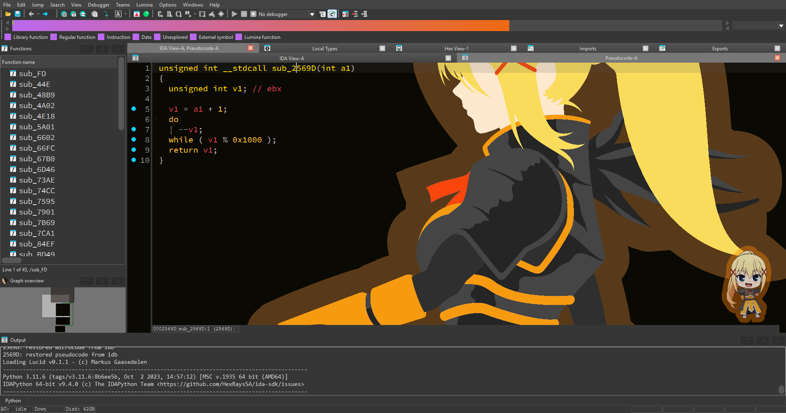

# Doki Theme for IDA Pro

Anime character themes — color palettes + character stickers — for IDA Pro,
ported from the [doki-theme](https://github.com/doki-theme) project (VS Code /
JetBrains) to a native **C++ IDA SDK plugin**.

Pick a character from the **Options** menu and IDA is retinted to match: the
disassembly listing, navigation band, selection and chrome take on the
character's palette, with the character's artwork shown behind the listing.

> Status: early (v0.1.0). All official doki themes supported — the
> runtime catalog is generated from a pinned snapshot of
> [doki-master-theme](https://github.com/doki-theme/doki-master-theme).
> At the time of the v0.1.0 build this is 88 themes across Azur Lane,
> Blend S, Bunny Senpai, Charlotte, Chuunibyou, Darling in the Franxx,
> Doki Doki Literature Club, Eromanga Sensei, Goblin Slayer, Gotoubun
> no Hanayome, Hataraku Saibou, Hunter x Hunter, ISEKAI QUARTET,
> JoJo's Bizarre Adventure, Kaguya-sama, Kill la Kill, KonoSuba,
> Midori no Hibi, Mob Psycho 100, My Hero Academia, Naruto, One Piece,
> Quintessential Quintuplets, Re:Zero, Shokugeki no Souma, Sword Art
> Online, Tonikaku Kawaii, and more.

## Screenshots

Darkness (dark variant) — disassembly listing, navigation band, chrome and
sticker all recolored from the character's palette:




## Features
- Character themes parsed from upstream `*.master.definition.json` files.
- Generates IDA `theme.css` (imports the matching `dark`/`default` base, then
  overrides the disassembly listing, selection, caret and nav band).
- Live **navigation-band** recolor (gradient) via the SDK colorizer — no restart.
- Character **sticker** rendered by a transparent Qt overlay on top of the
  active viewer (no mouse/focus interference).
- Full-listing **wallpaper** painted on `CustomIDAMemo` via CSS
  `background-image` (`$RELPATH`); transparency comes from the per-pixel
  alpha baked into the upstream Doki PNG.
- **On-demand asset download** from the authoritative doki-theme CDN
  (`https://doki.assets.unthrottled.io`). The first apply fetches each
  theme's sticker and transparent wallpaper; later applies (including
  offline sessions) read from the local cache under
  `$IDAUSR\doki-theme\cache\`.
- Menu actions: pick / random / next / toggle sticker / toggle wallpaper /
  restore default.
- Remembers your character + sticker / wallpaper preferences across restarts.
- Restores IDA cleanly on unload (nav colorizer + menu actions removed).

## How it works
| Surface | Mechanism | When it applies |
|---|---|---|
| Sticker and wallpaper PNGs | downloaded on first use, cached under `$IDAUSR/doki-theme/cache/{stickers,wallpapers}/` | transparent, no UI prompts; offline after first use |
| Disassembly listing, chrome, selection | generated `theme.css` in `$IDAUSR/themes/doki-<name>/`, activated via the `ThemeName` registry value | next IDA launch / reselect in *Options ▸ Colors* (IDA loads CSS at startup) |
| Sticker on the active view | transparent Qt overlay (input pass-through) | immediately, live |
| Navigation band | `set_nav_colorizer` (SDK) | immediately, live |

The CSS uses the per-pixel alpha of the upstream Doki PNG; no CSS opacity,
no Qt wallpaper layer, no runtime transparency controls.

## Install and setup

**Requirements**
- IDA Pro 9.0 or newer (developed and tested against IDA 9.4 / SDK 9.3, x64).
- Internet access the first time you apply each theme; subsequent applies
  work offline from the local cache.

**Install from the release ZIP**
The recommended end-user source is the distributable ZIP produced by the
project build (it contains the plugin DLL and the generated theme catalog).

1. Copy `plugins\doki_theme.dll` into your IDA `plugins` directory, either:
   - the IDA install dir: `<IDADIR>\plugins\`, or
   - your user dir: `%APPDATA%\Hex-Rays\IDA Pro\plugins\` (the `$IDAUSR`
     user directory).
2. Copy the catalog file `doki-theme\theme_catalog.json` to:
   ```
   %APPDATA%\Hex-Rays\IDA Pro\doki-theme\theme_catalog.json
   ```
   (i.e. `$IDAUSR\doki-theme\theme_catalog.json`).
3. Start IDA and open a database. The plugin's menu actions appear under
   the **Options** menu.

**First-use asset download**
Sticker and wallpaper images are **not** shipped in the package. The first
time you apply a character, the plugin downloads its sticker and
full-listing wallpaper from `https://doki.assets.unthrottled.io` and
caches them under `$IDAUSR\doki-theme\cache\`. Later applies — including
offline sessions — read straight from the cache.

For full install, uninstall, and troubleshooting details, see
[INSTALL.md](INSTALL.md).

## Use the plugin

All actions live under the **Options** menu:

- **Doki Theme: Pick character...** — open the chooser and select a
  character.
- **Doki Theme: Random character** / **Doki Theme: Next character** —
  cycle through themes quickly without opening the chooser.
- **Doki Theme: Toggle sticker** — show or hide the character overlay on
  the active view.
- **Doki Theme: Toggle wallpaper** — show or hide the full-listing
  wallpaper behind the disassembly.
- **Doki Theme: Restore default** — revert to your previous
  (non-Doki) IDA theme.

**What changes when you apply a character**
- The **navigation band** recolor and the **sticker overlay** apply
  immediately, live.
- The full IDA theme (disassembly listing, chrome, selection, caret) is
  generated under `$IDAUSR\themes\doki-<name>\` and activated via the
  `ThemeName` registry value. Because IDA loads theme CSS at startup,
  those colors apply on the next IDA launch, or right away if you
  reselect the theme in *Options ▸ Colors*.
- Your selected character and sticker/wallpaper preferences persist
  across restarts in `$IDAUSR\doki-theme\config.json`.

## Build
Prerequisites: IDA SDK 9.2+ (`IDASDK` env var), CMake 3.27+, Visual Studio 2022
(MSVC), the bundled [`ida-cmake`](https://github.com/allthingsida/ida-cmake)
(ships inside the official HexRaysSA/ida-sdk under `$IDASDK/ida-cmake`).
The plugin also links against `Qt6::Network` (the developer's Qt6 install,
pointed to via `DOKI_QT_DIR` or `CMAKE_PREFIX_PATH`).

```powershell
# 0) One-time / when bumping upstream themes: snapshot definitions
#    (network access; uses codeload tarball, not the rate-limited
#    GitHub Contents API).
tools\fetch_upstream.ps1
# 1) Generate the catalog from the snapshot (deterministic, offline).
tools\generate_theme_catalog.ps1
# 2) Build the plugin.
cmake -S . -B build -G "Visual Studio 17 2022" -A x64
cmake --build build --config Release
# 3) Deploy for local testing (DLL -> IDADIR\plugins, catalog -> $IDAUSR\doki-theme).
tools\deploy.ps1
# 4) Build a distributable zip in dist\.
cmake --build build --target package        # or: tools\package.ps1
```

The catalog generator is also wired into CMake: `cmake --build build
--target generate_catalog` and `cmake --build build --target
fetch_upstream` work as shortcuts for steps 0/1 above.

## Adding more characters
Official themes come from the pinned upstream snapshot and are
shipped via the generated `theme_catalog.json`. To bring in more:

1. **Refresh from upstream** (network; pulls the latest pinned
   snapshot of `doki-theme/doki-master-theme`):
   ```powershell
   tools\fetch_upstream.ps1          # update third_party/doki-master-theme
   tools\generate_theme_catalog.ps1  # rebuild generated/theme_catalog.json
   cmake --build build --target package
   tools\deploy.ps1
   ```
   To pin a different upstream commit, pass it explicitly:
   ```powershell
   tools\fetch_upstream.ps1 -Ref <sha>
   ```

2. **Custom characters not in upstream** — drop a hand-written
   `*.master.definition.json` into
   `$IDAUSR\doki-theme\definitions\`. Custom definitions are loaded
   after the catalog and appear in the picker as additional
   characters. The asset manager needs explicit `remotePath` fields
   on the sticker / background blocks; the bundled
   `assets/ATTRIBUTION.md` documents the upstream CDN layout.

3. **Pre-warm the local cache** (offline development / air-gapped
   testing):
   ```powershell
   tools\fetch_assets.ps1                       # every unique theme asset
   tools\fetch_assets.ps1 -GroupLike "Re Zero"  # only one series
   ```

## Cross-platform notes
The engine is plain C++ + IDA SDK (no Qt linkage in tty mode), so it ports
cleanly. Qt and `Qt6::Network` are used by the sticker overlay and the asset
manager; the rest is portable.
- **Output name:** `doki_theme.dll` (Windows) / `.so` (Linux) / `.dylib` (macOS)
  — handled by `ida_add_plugin`.
- **`$IDAUSR` default:** `%APPDATA%\Hex-Rays\IDA Pro` (Windows),
  `~/.idapro` (Linux/macOS). All paths resolve via `get_user_idadir()`.
- **Theme activation:** uses the `ThemeName` registry/config value through
  the SDK registry API, which is abstracted per-platform by IDA.
- Path separator handling is centralized in `src/doki/paths.cpp`.

Only Windows is built/tested so far; Linux/macOS should build with the same
CMake against their SDKs.

## Attribution
Theme palettes and character art come from the **doki-theme** project
by Alex Simons (Unthrottled) and contributors — see
[`assets/ATTRIBUTION.md`](assets/ATTRIBUTION.md),
[upstream definitions repo](https://github.com/doki-theme/doki-master-theme),
and the
[upstream asset repository](https://github.com/doki-theme/doki-theme-assets).
Character artwork belongs to the respective studios/artists.

## License
Plugin code: MIT (see LICENSE). Bundled doki assets retain their upstream terms.
